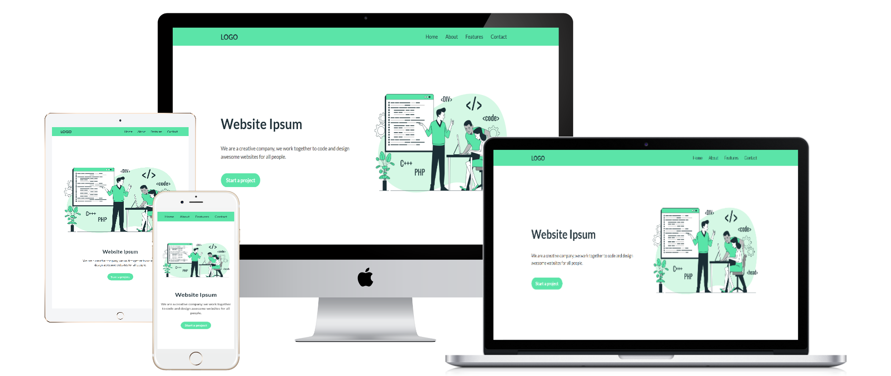

# Odin Landing Page

Odin Landing Webpage project created for The Odin Project foundations course.
 

## Preview

 
 

## Live Demo 

Check it out on [GitHub Webpages](https://redwanhaitami.github.io/odin-landing-page/) 
 

## Structure 

The landing page consists of the following sections:

- **Header:** this section includes:

  - `h3` heading element as a logo
  - `Header links` to the corresponding section of the landing page.

- **Hero Section:** this section includes:

  - `h1` heading element as a main title with subtext 
  - Hero image
  - Call-to-action button
  
- **Information Section:** this section includes:
  
  - `h2` heading element as a title
  - Four icons, each with subtext
  
- **Quote Section:** this section includes:
  
  - A quote and its author
  
- **Contact Section:** this section includes:
  
  - `h3` heading with subtext
  - Call-to-action button

- **Footer:** this section includes: 
  
  - Paragraph as a copyright information
 

## Skills and tools

The project built with:

- Semantic HTML markup
- CSS custom properties 
- CSS Flexbox 
- CSS Media Queries for both desktop and mobile devices
- [Font Awesome Library](https://fontawesome.com/) for icons
 

### Attributions 

Hero image provided by [Freepik](https://freepik.com/)
